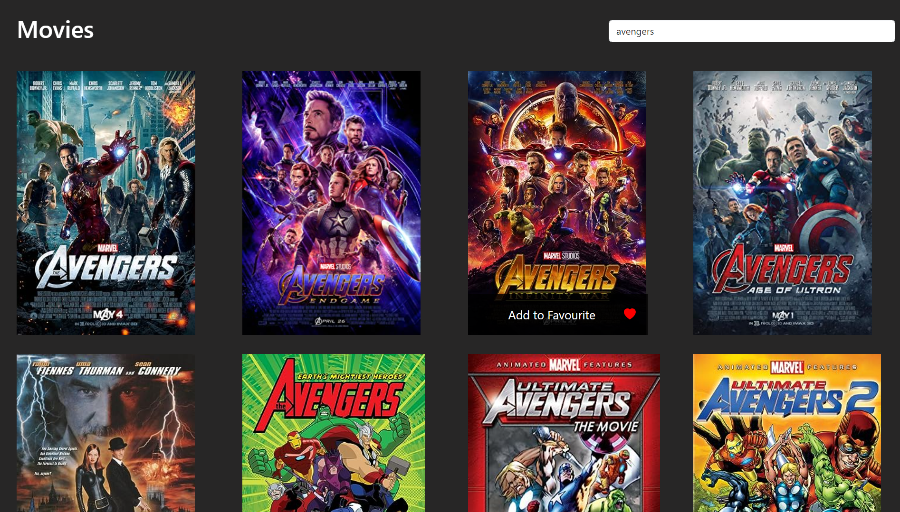

<div align="center">

# FilmFinder Movie App ✨

## ✨ [Live Preview](https://darshan-movie-app.netlify.app/)

<h3>Home Section</h3>


</div>

# ⚡Tech Stack

**Front End :** ReactJS, Bootstrap

**API :** [OMDB API](https://www.omdbapi.com/)

# FilmFinder Movie App

This is a simple movie application built with React. It allows users to search for movies and add them to their favourites list.

## Features

- Search for movies using the OMDB API
- Add movies to favourites
- Remove movies from favourites

## 🚀 Getting Started

Clone the project

```bash
  git clone https://github.com/darshangaikwad4114/Movie-app.git
```

Go to the project directory

```bash
  cd Movie-app
```

Install dependencies

```bash
  npm install
```

## Usage

1. Start the development server:
    ```bash
    npm start
    ```
2. Open your browser and navigate to `http://localhost:3000`.

## Testing

Run the tests using the following command:
```bash
npm test
```

## ✊ Show your support

Give a ⭐️ if this project helped you!

# 📝License

[](https://github.com/darshangaikwad4114/Movie-app/blob/main/LICENCE)

# 🙌🏻 Feedback

If you have any feedback, please reach out to us at --> darshangaikwad4114@gmail.com
